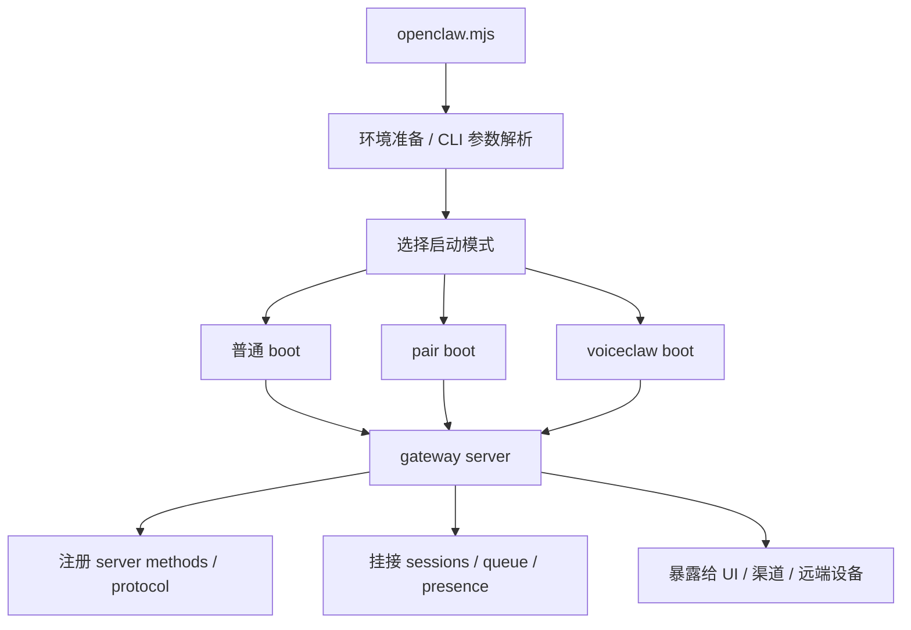

# OpenClaw 启动流程与控制面

## 1. 启动面应该怎么理解

OpenClaw 的启动不是“命令行执行一下 main()”这么简单。  
从仓库结构和 gateway 子目录就能看出，它至少要处理三类启动问题：
- 常规主程序启动
- 配对或远端接入相关启动
- 语音/实时接入相关启动

`src/gateway` 下公开可见的几个文件尤其关键：
- `boot.ts`
- `boot-pair.ts`
- `boot-voiceclaw.ts`

这说明系统在启动阶段就已经按照不同运行模式做分支，而不是统一入口里塞大量 `if/else`。

## 2. 推测的高层启动链路

结合根入口和 gateway 文档，可以把启动链路概括为：

这里的后半段不是空想，而是与公开文档相互印证：
- gateway 负责统一协议边界
- sessions / groups / queue 是统一状态入口
- Control UI 和 remote pair 都依赖 gateway

## 3. Gateway 为什么是控制面核心

`docs/gateway-architecture.md` 说明了几个关键点：
- 当前使用的是 RPC adapters
- 不是直接兼容 JSON-RPC、LSP 或 ACP 的公共协议面
- 使用 TypeBox schemas 作为类型约束

这意味着 gateway 的职责至少包括：
- 内部能力的协议化
- 入参与出参的强约束
- 不同接入端的统一适配
- 服务端方法注册与暴露

从源码目录看，`src/gateway` 内部也正对应这些职责：
- `protocol/`：协议对象、schema、消息结构
- `server-methods/`：真正对外暴露的方法集合
- `server/`：承载服务运行

## 4. 为什么不用“开放标准协议”作为第一层

官方文档直说当前不是直接做成 JSON-RPC/LSP/ACP 风格。  
这是个非常务实的决策。

原因大概率有三点：
- OpenClaw 的内部状态模型比普通 RPC 更复杂，尤其是 session/group/presence/queue
- 平台还在快速演进，过早冻结公共协议会拖慢内部迭代
- 内部先把类型边界和能力面收敛，再决定哪些部分对外标准化，工程风险更低

这是一种“先做稳定内核，再做开放协议”的路线。

## 5. Pair 与 VoiceClaw 启动分支的含义

### 5.1 `boot-pair.ts`

官方 Pair 文档说明：
- 系统会创建可信配对 token
- 支持二维码或远程设备配对
- 配对流程是 OpenClaw 连接其他终端/设备的关键入口

这意味着 `boot-pair.ts` 很可能不是简单辅助脚本，而是带有独立安全上下文的启动模式。

### 5.2 `boot-voiceclaw.ts`

`src/gateway/voiceclaw-realtime` 和 `boot-voiceclaw.ts` 同时出现，说明语音接入被视为一级运行模式。  
这不是“调用一下 speech SDK”的级别，而是：
- 有独立接入协议
- 有实时会话处理
- 需要被 gateway 纳入统一状态与身份边界

## 6. Assistant Identity 与 Prompt 不是散落逻辑

`src/gateway` 里直接存在：
- `agent-prompt.ts`
- `assistant-identity.ts`

这两个文件放在 gateway 旁边很有代表性。  
它意味着系统把“助手是谁”和“对外展示什么身份/提示”也纳入控制面，而不是完全下沉到 agent runtime 里。

这有两个好处：
- 不同入口接入时，身份与提示的一致性更容易保证
- gateway 可以在能力暴露、工具边界、远端设备接入时施加统一策略

## 7. Control UI 在控制面中的位置

官方 Control UI 文档表明：
- UI 技术栈是 `Vite + Lit`
- 它是 Control UI，而不是内容型应用

分析推断：
- UI 很可能是 gateway 的一个直接消费者
- UI 看到的不是零散 REST 资源，而是更接近 session / queue / presence / commands 这一类平台概念

从架构上说，UI 更像“控制台”而不是“聊天壳”。

## 8. 控制面最值得注意的设计

### 8.1 启动模式显式分拆

把不同 boot 文件拆开，说明团队在有意识控制复杂度。  
否则 pair、voice、normal 入口全堆在一个文件里会很快不可维护。

### 8.2 Gateway 不是边缘层，而是系统中心

很多系统把 gateway 当入口代理。  
OpenClaw 的 gateway 更像“统一控制总线”。

### 8.3 Identity / Prompt / Protocol / Server Methods 被放在同一邻域

这说明平台作者认为这些概念在控制面上是强耦合的：
- 身份定义影响能力暴露
- 协议定义影响 UI 和远端接入
- prompt 影响 agent 的默认行为
- server methods 是具体执行接口

## 9. 源码阅读建议

如果你要沿着启动链路读，建议按这个顺序：
1. `openclaw.mjs`
2. `package.json`
3. `src/gateway/boot.ts`
4. `src/gateway/boot-pair.ts`
5. `src/gateway/boot-voiceclaw.ts`
6. `src/gateway/protocol/*`
7. `src/gateway/server-methods/*`
8. `docs/gateway-architecture.md`
9. `docs/pair.md`
10. `docs/control-ui.md`

这样先抓“系统怎样起来”，再去看“起来之后 agent 怎样跑”。

