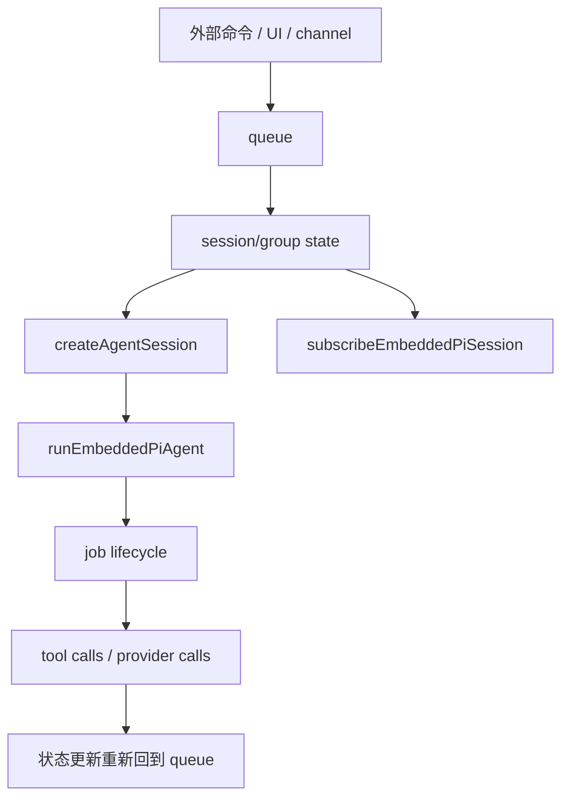

# OpenClaw Agent Loop、会话与队列

## 1. 先抓住三条主线

OpenClaw 这部分最核心的不是“模型怎么调”，而是三条并行主线：
- agent 怎么被创建与驱动
- session/group 怎么承载上下文
- queue 怎么保障状态修改顺序

如果这三条没理清，源码会显得非常散。

## 2. Agent Loop 的真实抽象

`docs/pi.md` 已经直接暴露了一批关键 API：
- `createAgentSession()`
- `runEmbeddedPiAgent()`
- `waitForAgentJob()`
- `subscribeEmbeddedPiSession()`
- `agentCommand()`

单看这些名字就能看出 OpenClaw 对 agent runtime 的建模方式：
- agent 不是无状态函数，而是绑定 session 的运行实体
- agent 运行不是单次调用，而是 job 化的生命周期
- 外界对 agent 的交互既可以是命令，也可以是订阅
- agent 运行是异步、可等待、可观测的

这是典型的平台式建模，而不是 demo 式建模。

## 3. Session 与 Group 为什么是一级概念

官方 session 文档给出的抽象非常关键：
- `sessionId` 对应具体会话实例
- `groupId` 对应更高层的上下文集合
- 一个 group 可以拥有多个 session
- fork、并行分支、回溯都依赖这套结构

可以把它理解成：

```text
group = 一个问题空间 / 对话树 / 工作上下文
session = 这个空间中的一个具体分支或执行轨迹
```

这比“一个聊天窗口一个 threadId”的建模强很多，因为它天然支持：
- 尝试多个方案
- 保留分支历史
- 回退到某个状态点
- 并行让多个 agent 跑不同路径

## 4. Queue 为什么是系统稳定器

官方 Queue 文档强调，所有状态修改操作都要通过 command queue 串行化。  
这是 OpenClaw 整个系统最关键的工程点之一。

因为在这个系统里，状态变更可能来自：
- 用户命令
- agent 输出
- tool 调用完成
- UI 操作
- 远端配对设备输入
- presence 更新
- 插件回调

如果这些修改直接并发写 session/group/state，很容易出错。  
因此 OpenClaw 采用的不是“让所有模块自己小心并发”，而是：
- 所有会改状态的动作统一进入 queue
- queue 决定执行顺序
- 状态层只需要面对串行后的 mutation

这是非常像数据库日志或 actor mailbox 的设计思路。

## 5. Agent 与 Session 的关系

从 `pi.md` 和 session 文档可以做出较稳妥的结构还原：



这张图体现了一个重要原则：
- session 不是 agent 的附属品
- 相反，agent 是“附着在 session 上运行”的

这让 UI、channels、plugins、远端设备都可以围绕 session 交互，而不是直接耦合到 agent 实现。

## 6. Presence 的作用

官方 Presence 文档说明，系统会跟踪用户、agent、连接状态等存在信息。  
Presence 单独成概念，说明 OpenClaw 在做的不只是 transcript 管理，还包括：
- 谁在线
- 谁在输入
- 哪个 agent 正忙
- 哪个设备已连接
- 哪个 session 当前活跃

分析推断：
- presence 很可能是 UI 实时状态、远端协作状态和 agent job 状态的桥梁
- 这也是为什么 OpenClaw 比普通 CLI agent 更像“实时协作控制台”

## 7. Session Compaction 的必要性

官方 `session-compaction` 文档给出了非常重要的信息：
- session 不会无限原样增长
- 系统会做压缩与摘要
- 关键片段通过 anchor 或 snippet 机制保留
- 需要时再把相关片段补回上下文

这说明 OpenClaw 对长上下文问题的处理不是简单 truncate，而是带结构的压缩：
- 保留主线摘要
- 保留关键锚点
- 保留可按需展开的片段

这种做法比“保留最近 N 条消息”成熟得多。

## 8. Memory 与 Session 的分工

仓库中 `memory` 是一级目录，而 session compaction 又是单独文档。  
这意味着 OpenClaw 至少区分：
- 短期对话轨迹：session transcript
- 结构化压缩结果：summary / snippets / anchors
- 更长期记忆：memory 层

分析推断：
- `session` 负责当前工作流
- `compaction` 负责让当前工作流可持续
- `memory` 负责跨 session / 跨阶段的知识留存

这三者分开，是平台级 agent 的典型成熟迹象。

## 9. 为什么 Group 比 Session 更重要

很多人第一次看会把 session 当主对象。  
但从文档看，真正稳定的业务边界很可能是 group。

原因：
- group 可以包含多个 session 分支
- fork/backtrack/parallel 都是 group 级能力
- session 更像局部执行切片

因此如果你以后要做：
- 分支对比
- 多 agent 并行探索
- 回退与重演
- 同一任务跨设备继续

group 才是应该优先守住的一层抽象。

## 10. 源码阅读建议

读这一层时，建议不要先找 provider 调用，而要先找：
1. `docs/pi.md`
2. `docs/sessions-and-groups.md`
3. `docs/session-compaction.md`
4. `docs/queue.md`
5. `src/agents/*`
6. `src/memory/*`
7. 与 session/group 相关的 gateway server methods

重点不是某个函数本身，而是以下四个问题：
- 哪些对象可以创建 session
- 哪些动作必须进 queue
- agent job 的状态怎样回流到 session
- 压缩和 memory 在哪个时机介入

## 11. 结论

OpenClaw 的 agent loop 设计说明它不是在“包装模型”，而是在“运行一个受控的会话型执行系统”。

真正的关键不是单次推理，而是：
- agent 如何绑定 session
- session 如何归属于 group
- 所有变更如何串行进 queue
- 长上下文如何通过 compaction 和 memory 维持

这四件事做对了，平台才可能稳定。

